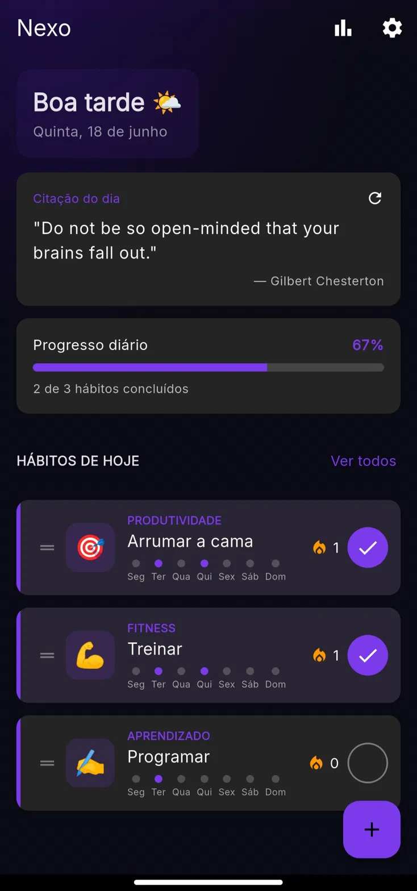
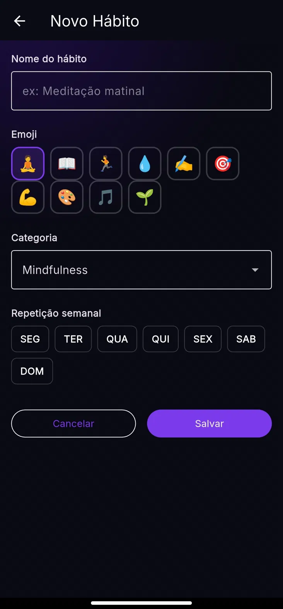
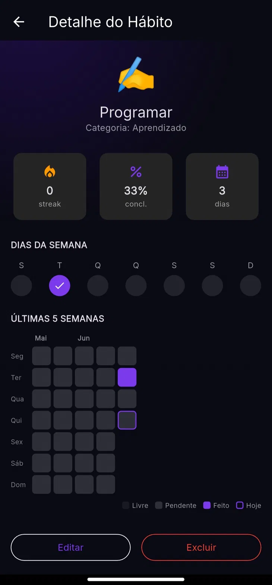
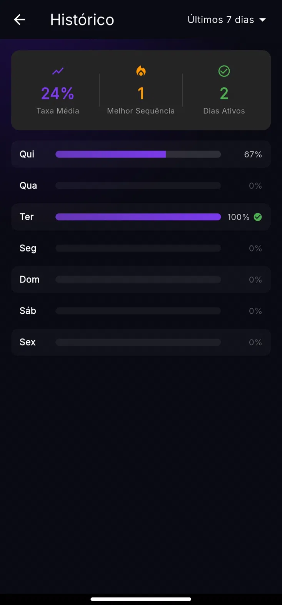
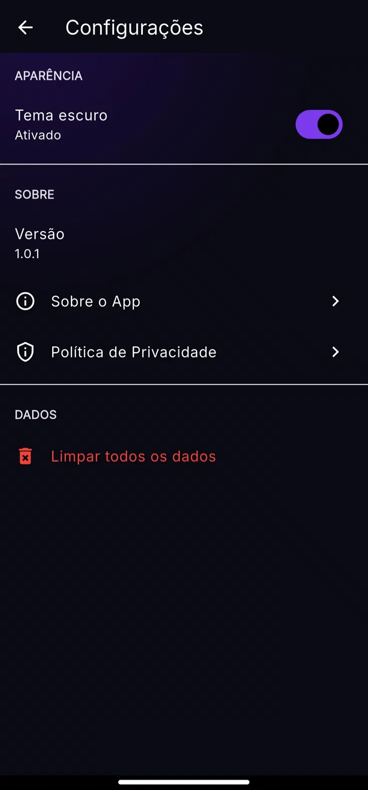
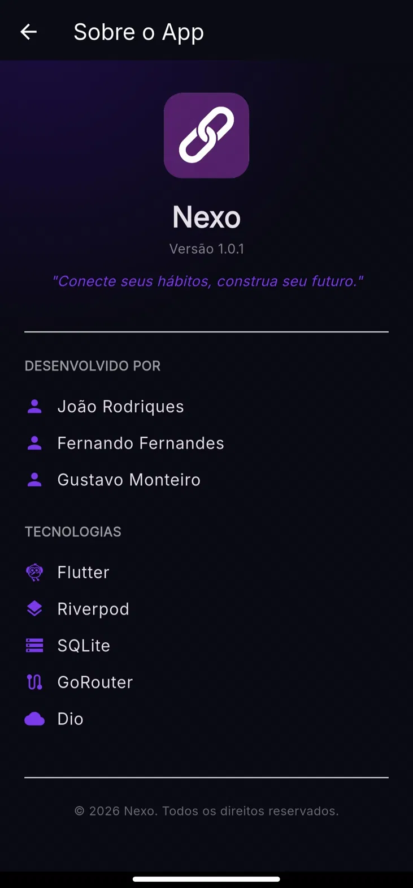
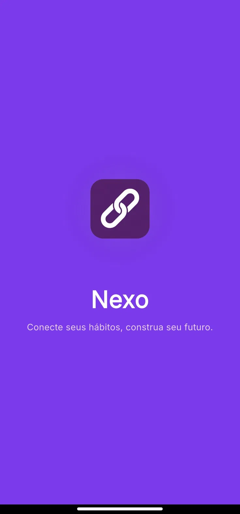

<div align="center">

# 🔗 Nexo

### Conecte seus hábitos, construa seu futuro.

[](https://flutter.dev)
[](https://riverpod.dev)
[](LICENSE)
[]()

**[🇧🇷 Português](#-sobre-o-projeto)** • **[🇺🇸 English](#-about-the-project)**

</div>

---

## 🇧🇷 Sobre o Projeto

**Nexo** é um aplicativo de rastreamento de hábitos desenvolvido em **Flutter**, criado como projeto final da disciplina de **Programação para Dispositivos Móveis** do curso de **Análise e Desenvolvimento de Sistemas (ADS)**.

O app permite criar, acompanhar e analisar hábitos diários através de streaks, taxas de conclusão e histórico visual de desempenho — tudo isso aplicando **Clean Architecture**, gerenciamento de estado reativo com **Riverpod** e persistência local robusta.

> Projeto desenvolvido em equipe, aplicando na prática os principais conceitos da reta final da disciplina: gestão de estado, navegação declarativa, consumo de API externa, persistência local e arquitetura limpa.

### ✨ Funcionalidades

- ✅ Criação de hábitos com emoji, categoria e dias de repetição semanal personalizados
- 🔥 Acompanhamento de **streaks** (sequências) e taxa de conclusão
- 📊 Histórico visual de desempenho por período (últimos 7 dias e mais)
- 💬 Citação motivacional diária, consumida de API externa
- 🎨 Tema escuro nativo, com identidade visual própria
- 💾 Persistência local completa — os dados continuam disponíveis ao reabrir o app
- 📱 Multiplataforma: Android e Windows Desktop

### 📱 Telas do Aplicativo

<table>
<tr>
<td align="center" width="33%">
<br/>
<b>Home</b><br/>
<sub>Visão geral do dia, progresso e citação diária</sub>
</td>
<td align="center" width="33%">
<br/>
<b>Novo Hábito</b><br/>
<sub>Criação com emoji, categoria e repetição semanal</sub>
</td>
<td align="center" width="33%">
<br/>
<b>Detalhe do Hábito</b><br/>
<sub>Streak, % de conclusão e mapa de calor semanal</sub>
</td>
</tr>
<tr>
<td align="center" width="33%">
<br/>
<b>Histórico</b><br/>
<sub>Taxa média, melhor sequência e dias ativos</sub>
</td>
<td align="center" width="33%">
<br/>
<b>Configurações</b><br/>
<sub>Tema, privacidade e gerenciamento de dados</sub>
</td>
<td align="center" width="33%">
<br/>
<b>Sobre o App</b><br/>
<sub>Créditos, equipe e stack tecnológica</sub>
</td>
</tr>
<tr>
<td align="center" width="33%">
<br/>
<b>Splash Screen</b><br/>
<sub>Tela de abertura com a identidade visual do app</sub>
</td>
</tr>
</table>

### 🏗️ Arquitetura

O projeto segue os princípios de **Clean Architecture**, com separação clara de responsabilidades em três camadas principais:

```
lib/
├── core/            # Configurações globais, temas, constantes e utilitários
├── data/            # Models, fontes de dados (local/remota) e implementação dos repositories
├── domain/          # Entidades de negócio, contratos de repository e casos de uso
└── presentation/    # Telas, widgets e providers (Riverpod)
```

Essa separação evita o acoplamento entre regra de negócio, acesso a dados e interface — cada camada conhece apenas o que precisa conhecer.

### 🛠️ Stack Tecnológica

| Categoria | Tecnologia |
|---|---|
| **Framework** | Flutter 3.41.4 |
| **Gerenciamento de Estado** | flutter_riverpod (padrão `Notifier`/`NotifierProvider`) |
| **Navegação** | go_router, com passagem de parâmetros entre telas |
| **Requisições HTTP** | dio |
| **API Externa** | [ZenQuotes](https://zenquotes.io/) — citações motivacionais diárias |
| **Persistência simples** | shared_preferences (tema, preferências do usuário) |
| **Persistência estruturada** | sqflite + sqflite_common_ffi (hábitos, histórico) |
| **Modelagem de dados** | freezed + json_annotation (geração de código) |
| **Tipografia** | google_fonts |

### 🧪 Testes

O projeto conta com cobertura de testes em três níveis, conforme exigido pela disciplina:

- **Testes unitários** — regras de negócio e conversão de dados (JSON → Model, cálculo de streak, taxa de conclusão)
- **Testes de widget** — renderização de componentes-chave (tela inicial, formulário de hábito, cards de hábito)
- **Teste de integração** — fluxo completo: abrir o app → criar hábito → marcar como concluído → verificar persistência

### 🚀 Como Executar

```bash
# Clone o repositório
git clone https://github.com/gutsfz/Nexo.git
cd Nexo

# Instale as dependências
flutter pub get

# Gere os arquivos do freezed/json_serializable
dart run build_runner build --delete-conflicting-outputs

# Rode o app
flutter run
```

> **Windows Desktop:** o app detecta automaticamente a plataforma e inicializa o `sqfliteFfiInit()` quando necessário — não é preciso configuração manual.

### 👥 Equipe

| Integrante | Responsabilidade |
|---|---|
| **João Rodrigues** | Desenvolvedor principal e coordenador do projeto |
| **Fernando Fernandes** | Camada de repositórios de dados (Data Layer) |
| **Gustavo Monteiro** | Camada de providers Riverpod (State Management) |

**Curso:** Análise e Desenvolvimento de Sistemas (ADS)
**Disciplina:** Programação para Dispositivos Móveis

### 📄 Licença

Este projeto está sob a licença MIT. Veja o arquivo [LICENSE](LICENSE) para mais detalhes.

---
---

## 🇺🇸 About the Project

**Nexo** is a habit-tracking application built with **Flutter**, developed as the final project for the **Mobile Devices Programming** course in the **Systems Analysis and Development** program.

The app lets users create, track, and analyze daily habits through streaks, completion rates, and a visual performance history — applying **Clean Architecture**, reactive state management with **Riverpod**, and robust local persistence.

> A team project built to put into practice the core concepts of the course: state management, declarative navigation, external API consumption, local persistence, and clean architecture.

### ✨ Features

- ✅ Create habits with custom emoji, category, and weekly repetition days
- 🔥 Track **streaks** and completion rate
- 📊 Visual performance history by time period (last 7 days and beyond)
- 💬 Daily motivational quote, fetched from an external API
- 🎨 Native dark theme with a distinct visual identity
- 💾 Full local persistence — data remains available after reopening the app
- 📱 Cross-platform: Android and Windows Desktop

### 📱 App Screens

<table>
<tr>
<td align="center" width="33%">
<br/>
<b>Home</b><br/>
<sub>Daily overview, progress, and quote of the day</sub>
</td>
<td align="center" width="33%">
<br/>
<b>New Habit</b><br/>
<sub>Creation with emoji, category, and weekly repetition</sub>
</td>
<td align="center" width="33%">
<br/>
<b>Habit Detail</b><br/>
<sub>Streak, completion % and weekly heatmap</sub>
</td>
</tr>
<tr>
<td align="center" width="33%">
<br/>
<b>History</b><br/>
<sub>Average rate, best streak, and active days</sub>
</td>
<td align="center" width="33%">
<br/>
<b>Settings</b><br/>
<sub>Theme, privacy, and data management</sub>
</td>
<td align="center" width="33%">
<br/>
<b>About</b><br/>
<sub>Credits, team, and tech stack</sub>
</td>
</tr>
<tr>
<td align="center" width="33%">
<br/>
<b>Splash Screen</b><br/>
<sub>Opening screen with the app's visual identity</sub>
</td>
</tr>
</table>

### 🏗️ Architecture

The project follows **Clean Architecture** principles, with a clear separation of concerns across three main layers:

```
lib/
├── core/            # Global config, themes, constants, and utilities
├── data/            # Models, data sources (local/remote), and repository implementations
├── domain/          # Business entities, repository contracts, and use cases
└── presentation/    # Screens, widgets, and providers (Riverpod)
```

This separation prevents coupling between business logic, data access, and UI — each layer only knows what it needs to know.

### 🛠️ Tech Stack

| Category | Technology |
|---|---|
| **Framework** | Flutter 3.41.4 |
| **State Management** | flutter_riverpod (`Notifier`/`NotifierProvider` pattern) |
| **Navigation** | go_router, with parameter passing between screens |
| **HTTP Client** | dio |
| **External API** | [ZenQuotes](https://zenquotes.io/) — daily motivational quotes |
| **Simple Persistence** | shared_preferences (theme, user preferences) |
| **Structured Persistence** | sqflite + sqflite_common_ffi (habits, history) |
| **Data Modeling** | freezed + json_annotation (code generation) |
| **Typography** | google_fonts |

### 🧪 Testing

The project includes test coverage at three levels, as required by the course:

- **Unit tests** — business rules and data conversion (JSON → Model, streak calculation, completion rate)
- **Widget tests** — rendering of key components (home screen, habit form, habit cards)
- **Integration test** — full flow: open the app → create a habit → mark it as completed → verify persistence

### 🚀 Getting Started

```bash
# Clone the repository
git clone https://github.com/gutsfz/Nexo.git
cd Nexo

# Install dependencies
flutter pub get

# Generate freezed/json_serializable files
dart run build_runner build --delete-conflicting-outputs

# Run the app
flutter run
```

> **Windows Desktop:** the app automatically detects the platform and initializes `sqfliteFfiInit()` when needed — no manual setup required.

### 👥 Team

| Member | Responsibility |
|---|---|
| **João Rodrigues** | Lead developer and project coordinator |
| **Fernando Fernandes** | Data repositories layer |
| **Gustavo Monteiro** | Riverpod providers layer (State Management) |

**Program:** Systems Analysis and Development
**Course:** Mobile Devices Programming

### 📄 License

This project is licensed under the MIT License. See the [LICENSE](LICENSE) file for details.

---

<div align="center">
<sub>Built with 💜 and Flutter</sub>
</div>
